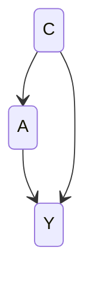
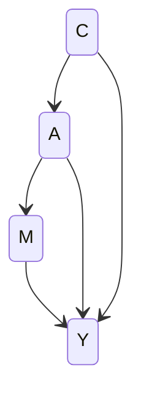
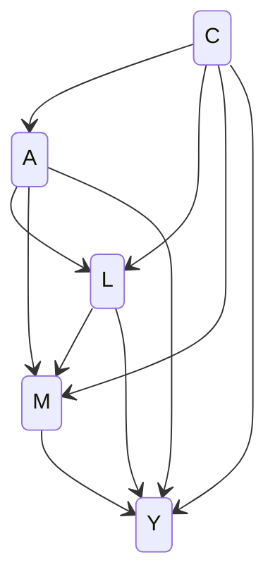
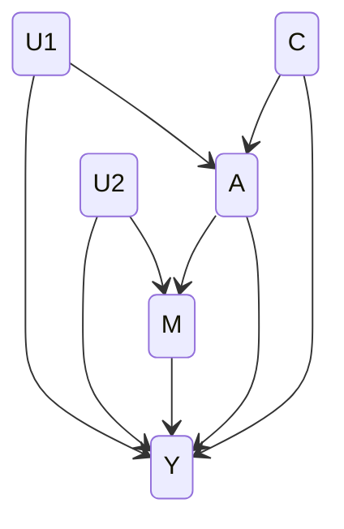

# causal-Graphical Normalizing Flows (cGNF)

## About cGNF

The causal-Graphical Normalizing Flows (cGNF) project focuses on answering causal questions with the use of normalizing flows. This project incorporates deep learning models from Graphical Normalizing Flows ([GNFs](https://github.com/AWehenkel/Graphical-Normalizing-Flows)) and Unconstrained Monotonic Neural Networks ([UMNNs](https://github.com/AWehenkel/UMNN)). 

The method assumes a causal structure for the data in the form of a Directed Acyclic Graph (DAG). It then learns a normalizing flow for the joint distribution of the data based on this causal structure. This flow is then inverted to perform hypothetical interventions and simulate potential outcomes.

---

## User Guide

This guide walks you through setting up the Python environment and utilizing `cGNF` to analyze your own dataset. For users who are new to Python, we recommend following the instructions step by step. Experienced Python users can directly `pip install cGNF` to download the libraries, and then skip to [Setting up a Dataset](#setting-up-a-dataset). 

The source code for cGNF is available on [GitHub](https://github.com/cGNF-Dev/cGNF). We're here for any questions, discussions, and contributions. We are committed to responding promptly and fostering a collaborative environment.

---

### Tutorial Contents

1. [Setting up `cNGF` with PyCharm](#setting-up-cgnf-with-pycharm)
2. [Setting up a Dataset](#setting-up-a-dataset)
   - [Preparing a Data Frame](#preparing-a-data-frame)
   - [Specifying a Directed Acyclic Graph (DAG)](#specifying-a-directed-acyclic-graph-dag)
3. [Training a Model](#training-a-model)
   - [Data Preprocessing](#data-preprocessing)
   - [Training](#training)
   - [Estimation](#estimation)
   - [Bootstrapping](#bootstrapping)
4. [Coding Tutorials with Simulated Data](#coding-tutorials-with-simulated-data)
   - [Estimating an Average Treatment Effect (ATE)](#estimating-average-treatment-effects-ate)
   - [Estimating Conditional Average Treatment Effects (CATE)](#estimating-conditional-average-treatment-effects-cate)
   - [Estimating Natural Direct and Indirect Effects](#estimating-direct-and-indirect-effects)
   - [Estimating Path-Specific Effects](#estimating-path-specific-effects)
   - [Conducting a Sensitivity Analysis](#conducting-a-sensitivity-analysis)
   - [Constructing Confidence Intervals with the Bootstrap](#constructing-confidence-intervals-with-the-bootstrap)

---

## Setting up `cGNF` with PyCharm

1. **Install Python**:
   
   Before you start, ensure you have Python 3.9 installed, other versions may not be compatible with the dependencies for `cGNF`:
   
   - [Download Python 3.9.13](https://www.python.org/downloads/release/python-3913/)
   
   During the installation, make sure to tick the option `Add Python to PATH` to ensure Python is accessible from the command line.

2. **Download & Install PyCharm Community Edition**:

   - [Download PyCharm Community Edition](https://www.jetbrains.com/pycharm/download/)

3. **Launch PyCharm**:

   - Start PyCharm Community Edition.

4. **Create a New Project**:

   - On the welcome screen, click on "Create New Project."
     
   - Name your project and choose its location.

5. **Set up a Virtual Environment**:

   - In the "Interpreter" section, select "Virtualenv".
     
   - Specify a location for the virtual environment (e.g., within your project directory).
     
   - Ensure the base interpreter points to your installed version of Python.
     
   - Click "Create" to create your new Python project with a virtual environment.

6. **Activate the Virtual Environment within PyCharm**:

   Once the project is created, PyCharm should automatically activate the virtual environment for you. You'll see the environment's name in the bottom-right corner of the PyCharm window.

7. **Install `cGNF` and Dependencies**:

   In PyCharm, open the terminal (usually at the bottom of the IDE).
   
   Install the `cGNF` package:

     ```bash
     pip install --index-url https://test.pypi.org/simple/ --extra-index-url https://pypi.org/simple cGNF
     ```

   To update the package in the future:

     ```bash
     pip install --upgrade --index-url https://test.pypi.org/simple/ --extra-index-url https://pypi.org/simple/ cGNF
     ```

   If you need PyTorch with CUDA support:

     ```bash
     pip install torch torchvision torchaudio cudatoolkit=<desired_version, e.g., 11.2> -c pytorch
     ```

9. **Start Developing with `cGNF`**:

   - Right-click on the project folder in the "Project" pane.
     
   - Choose "New" and then "Python File" to start creating Python scripts using `cGNF`.

---

## Setting up a Dataset

### Preparing a Data Frame

   Ensure your data frame is stored in CSV format with the first row set as variable names and subsequent rows as values. An example structure:
        
   | X         | Y          | Z         |
   |-----------|------------|-----------|
   | -0.673503 | 0.86791503 | -0.673503 |
   | 0.7082311 | -0.8327477 | 0.7082311 |
   | ...       | ...        | ...       |

   *Note*: any row with at least one missing value will be automatically removed during the data preprocessing stage (see [Training a Model](#training-a-model)).

---

### Specifying a Directed Acyclic Graph (DAG)

   `cGNF` utilizes an adjacency matrix in CSV format to recognize a DAG. Use the following steps in Python to generate an adjacency matrix:
    
   #### a. **Import Required Libraries**:
    
   ```python
    import collections.abc
    collections.Iterable = collections.abc.Iterable 
    import networkx as nx 
    from causalgraphicalmodels import CausalGraphicalModel     
   ```
    
   #### b. **Draw the DAG**:
    
   Define your DAG structure using the `CausalGraphicalModel`:
    
   ```python
    Your_DAG_name = CausalGraphicalModel(
        nodes=["var1", "var2", ...],
        edges=[("parent", "child"), ...]
    )
   ```
    
   For example, with a simple DAG X &rarr; Y &rarr; Z, the argument will be as follows:
    
   ```python
   Simple_DAG = CausalGraphicalModel(
       nodes=["X", "Y", "Z"],
       edges=[("X", "Y"), ("Y", "Z")]
   )
   ```
    
   #### c. **Convert the DAG to an Adjacency Matrix**:
    
   ```python
   your_adj_mat_name = nx.to_pandas_adjacency(Your_DAG_name.dag, dtype=int)
   ```
    
   Save the matrix as a CSV file:
    
   ```python
   your_adj_mat_name.to_csv('/path_to_data_directory/' + 'your_adj_mat_name' + '.csv')
   ```
    
   #### d. **Manually Create an Adjacency Matrix**:
    
   Alternatively, you can manually create an adjacency matrix in a CSV file by listing variables in both the first row and the first column. Here's how you interpret the matrix:
    
   - The row represents the parent node, and the column represents the child node.
      
   - If the cell at row X and column Y (i.e., position (X, Y)) contains a 1, it means X leads to Y.
      
   - If it contains a 0, it means X does not lead to Y.
  
   - Remember, since this is a directed graph, a 0 at position (Y, X) doesn't imply a 0 at position (X, Y).
    
   For example, the below adjacency matrix describes a DAG where X &rarr; Y &rarr; Z. 
    
   |   | X | Y | Z |
   |---|---|---|---|
   | X | 0 | 1 | 0 |
   | Y | 0 | 0 | 1 |
   | Z | 0 | 0 | 0 |

   _Note_: 
     
   - Make sure you save the adjacency matrix in the same directory as your dataframe.
   
---

## Training a Model

### Essential Functions

`cGNF` is implemented in three stages, corresponding to three separate Python functions:

1. **`process`**: Prepares the dataset and adjacency matrix.
   
2. **`train`**: Trains the model.
   
3. **`sim`**: Estimates potential outcomes.

Additionally, a **`bootstrap`** function is provided to facilitate parallel execution of these functions across multiple CPU cores.

---

### Data Preprocessing

   ```python
    from cGNF import process
    process(
        path='/path_to_data_directory/',  # File path where the dataset and DAG are located
        dataset_name='your_dataset_name',  # Name of the dataset
        dag_name= 'you_adj_mat_name',  # Name of the adjacency matrix (DAG) to be used
        test_size=0.2,  # Proportion of data used for the validation set
        cat_var=['X', 'Y'],  # List of categorical variables
        sens_corr={("X", "Y"):0.2, ("C","Y"):0.1}, # Vector of sensitivity parameters (i.e., normalized disturbance correlations)
        seed=None  # Seed for reproducibility
    )
   ```

   *Notes*:
   - `cat_var`: If the dataset has no categorical variables, set `cat_var=None`.

   - `sens_corr`: If specified, the train and sim functions will produce bias-adjusted estimates using the supplied disturbance correlations.
   
   - The function will automatically remove any row that contains at least one missing value.

   - The function converts the dataset and the adjacency matrix into tensors. These tensors are then packaged into a PKL file named after `dataset_name` and saved within the `path` directory. This PKL file is later used for model training.

---

### Training
   
   ```python
    from cGNF import train
    train(
        path='/path_to_data_directory/',  # File path where the PKL file is located
        dataset_name='your_dataset_name',  # Name of the dataset
        model_name='models',  # Name of the folder where the trained model will be saved
        trn_batch_size=128,  # Training batch size
        val_batch_size=2048,  # Validation batch size
        learning_rate=1e-4,  # Learning rate
        seed=None,  # Seed for reproducibility
        nb_epoch=50000,  # Number of total epochs
        emb_net=[90, 80, 60, 50],  # Architecture of the embedding network (nodes per hidden layer)
        int_net=[50, 40, 30, 20],  # Architecture of the integrand network (nodes per hidden layer)
        nb_estop=50,  # Number of epochs for early stopping
        val_freq=1  # Frequency per epoch with which the validation loss is computed
    )
   ```

   *Notes*:
   - `model_name`: The folder will be saved under the `path`.
     
   - Hyperparameters that influence the neural network's performance include the number of layers and nodes in `emb_net` & `int_net`, the early stopping criterion in `nb_estops`, the learning rate in `learning_rate`, the training batch size in `trn_batch_size`, and the frequency with which the validation loss is evaluated to determine whether the early stopping criterion has been met in `val_freq`. When setting these parameters, always be mindful of the potential for bias (in simple models, trained rapidly, with a stringent early stopping criterion) versus overfitting (in complex models, trained slowly, with little regularization).

---

### Estimation

   ```python
    from cGNF import sim
    sim(
        path='/path_to_data_directory/',  # File path where the PKL file is located
        dataset_name='your_dataset_name',  # Name of the dataset
        model_name='models',  # Name of the folder where the trained model is located
        n_mce_samples=50000,  #  Number of Monte Carlo draws from the trained distribution model
        treatment='X',  # Treatment variable
        cat_list=[0, 1],  # Treatment values for counterfactual outcomes
        moderator='C',  # Specify to conduct moderation analysis (i.e., compute effects conditional on the supplied moderator)
        quant_mod=4,  # If the moderator is continuous, specify the number of quantiles used to evaluate the conditional effects
        mediator=['M1', 'M2'],  # List mediators for mediation analysis (i.e., to compute direct, indirect, or path-specific effects)
        outcome='Y',   # Outcome variable
        inv_datafile_name='your_counterfactual_dataset'  # Name of the file where Monte Carlo samples are saved
    )
   ```

   *Notes*:
   - Increasing `n_mce_samples` helps reduce simulation error during the inference stage but may increase computation time.

   - `cat_list`: Multiple treatment values are permitted. If a mediator is specified, only two values are allowed, where the first value represents the control condition and the second represents the treated condition.

   - `moderator`: If the moderator is categorical and has fewer than 10 categories, the function will display potential outcomes based on different moderator values.

     For continuous moderators or those with over ten categories, the outcomes are displayed based on quantiles, determined by `quant_mod`. By default, with `quant_mod=4`, the moderator values are divided on **quartiles**.

     When conditional treatment effects are not of interest, or the dataset has no moderators, set `moderator=None`.

   - `mediator`: Multiple mediators are permitted. When specifying several mediators, ensure they are supplied in their causal order, in which case the function returns a set of path-specific effects.

     When direct, indirect, or path-specific effects are not of interest, or the dataset has no mediators, set `mediator=None`.

     Moderated mediation analysis is available by specifying the `moderator` and `mediator` parameters simultaneously.

   - `inv_datafile_name`: The function, by default, creates `potential_outcome.csv`, which holds counterfactual samples derived from the `cat_list` input values, and `potential_outcome_results.csv`, cataloging the computed potential outcomes. These outputs are saved in the designated `path` directory.

     With `mediator` specified, additional counterfactual data files will be produced for each path-specific effect. These files are named with the suffix m*n*_0 or m*n*_1, corresponding to different treatment conditions.

     The suffix '_0' indicates the scenario where the treatment and all subsequent mediators past the *n*th mediator are set to the control condition, whereas the *n*th mediator and those before it assume the treated condition.

     Conversely, the suffix '_1' indicates the scenario where the treatment and all mediators following the *n*th mediator are in the treated condition, and those mediators preceding and including the *n*th mediator are in the control condition.

---

### Bootstrapping

   ```python
   process_args={
      "seed": 2121380
      }

   train_args={
      "seed": 2121380
      }

   sim_args1={
      "treatment": 'A',
      "outcome": 'Y',
      "inv_datafile_name": 'A_Y'
      }

   sim_args2={
      "treatment": 'C',
      "outcome": 'Y',
      "inv_datafile_name": 'C_Y'
      }

    from cGNF import bootstrap
    bootstrap(
       n_iterations=10,  # Number of bootstrap iterations
       num_cores_reserve=2,  # Number of cores to reserve
       base_path='/path_to_data_directory/',  # Base directory where the dataset and DAG are located
       folder_name='bootstrap_2k',  # Folder name for this bootstrap session
       dataset_name='your_dataset_name',  # Name of the dataset being used
       dag_name='you_adj_mat_name',  # Name of the DAG file associated with the dataset
       process_args=process_args,  # Arguments for the data preprocessing function
       train_args=train_args,  # Arguments for the model training function
       sim_args_list=[sim_args1, sim_args2]  # List of arguments for multiple estimation configurations
    )
   ```

   *Notes*:
   - The function generates a file named `<dataset_name>_result.csv` under `base_path`, which contains all the potential outcome results from each bootstrap iteration.

   - To skip certain stages, you can add `skip_process=True`, `skip_train=True`, or set `sim_args_list=None`.
     
   - The function generates `n_iterations` number of folders under `base_path`, each named with the `folder_name` followed by an iteration suffix.
     
   - `base_path`, `dataset_name`, and `dag_name` are automatically included in `process_args`, `train_args`, and `sim_args_list`, so you don't need to specify them separately for each set of arguments.
     
   - When specifying parameters in each set of arguments (`_args`), enclose parameter names in single (`'`) or double (`"`) quotes and use a colon (`:`) instead of an equals sign (`=`) for assignment.

#### Remember to adjust paths, environment names, and other placeholders.

---

## Coding Tutorials with Simulated Data

### Estimating Average Treatment Effects (ATE)
(See **`cGNF_ATE.py`** for detailed implementation)

Define the data generating process (DGP) as:

$$
\begin{align*}
A &\sim \text{Binomial}(0.5) \\
\\
Y &\sim 
\begin{cases} 
\text{Binomial}(0.6) & \text{if } A = 1 \\
\text{Binomial}(0.4) & \text{if } A = 0 
\end{cases}
\end{align*}
$$

The corresponding directed acyclic graph (DAG):


#### Steps:

1. Generate _N_ samples from the DGP and construct the corresponding adjacency matrix.
2. Store both the sample dataframe and adjacency matrix at the designated `path`.
3. Process the dataset and initiate model training.
4. Conduct potential outcome estimation to estimate:

$$
\begin{align*}
   &E[Y(A=0)] \\
   &E[Y(A=1)]
\end{align*}
$$

$$
\begin{align*}
\text{Average Treatment Effect (ATE)} &= E[Y(A=1)] - E[Y(A=0)]
\end{align*}
$$

---

### Estimating Conditional Average Treatment Effects (CATE)
(See **`cGNF_CATE.py`** for detailed implementation)

Define the DGP as:

$$
\begin{align*}
C &\sim \text{Binomial}(0.5) \\
\\
\epsilon_A &\sim \text{Logistic}(0, 1) \\
\epsilon_Y &\sim \text{Normal}(0, 1) \\
\\
A &= 0.3 \cdot C + \epsilon_A \\
Y &= 0.4 \cdot C + 0.2 \cdot A + \epsilon_Y
\end{align*}
$$

The corresponding DAG:



#### Steps:

1. Generate _N_ samples from the DGP and construct the corresponding adjacency matrix.
2. Store both the sample dataframe and adjacency matrix at the designated `path`.
3. Process the dataset and initiate model training.
4. Conduct potential outcome estimation to estimate:

$$
\begin{align*}
   &E[Y(A=0 | C=0)] \\
   &E[Y(A=0 | C=1)] \\
   &E[Y(A=1 | C=0)] \\
   &E[Y(A=1 | C=1)]
\end{align*}
$$


$$
\begin{align*}
&\text{Conditional Average Treatment Effects (CATE)}= \\
&E[Y(A=1 | C=0)] - E[Y(A=0 | C=0)] \\
&and \\
&E[Y(A=1 | C=1)] - E[Y(A=0 | C=1)]
\end{align*}
$$

---

### Estimating Direct and Indirect Effects 
(See **`cGNF_ND(I)E.py`** for detailed implementation)

Define the DGP as:

$$
\begin{align*}
C &\sim \text{Binomial}(0.4) \\
\\
\epsilon_A &\sim \text{Normal}(0, 1) \\
\epsilon_M &\sim \text{Logistic}(0, 1) \\
\epsilon_Y &\sim \text{Laplace}(0, 1) \\
\\
A &= 0.2 \cdot C + \epsilon_A \\
M &= 0.25 \cdot A + \epsilon_M \\
Y &= 0.2 \cdot C + 0.1 \cdot A + 0.4 \cdot M + \epsilon_Y
\end{align*}
$$

The corresponding DAG:



#### Steps:

1. Generate _N_ samples from the DGP and construct the corresponding adjacency matrix.
2. Store both the sample dataframe and adjacency matrix at the designated `path`.
3. Process the dataset and initiate model training.
4. Conduct potential outcome estimation to estimate:

$$
\begin{align*}
   &E[Y(A=0)] \\
   &E[Y(A=0, M(A=1))] \\
   &E[Y(A=1)] \\
   &E[Y(A=1, M(A=0))]
\end{align*}
$$

* Direct and Indirect Effects Decomposition:

$$
\begin{align*}
   \text{Natural Direct Effect (NDE)} & = E[Y(A=1, M(A=0))] - E[Y(A=0)] \\
   \\
   \text{Natural Indirect Effects (NID)} & = E[Y(A=1)] - E[Y(A=1, M(A=0))] \\
   \\
   \text{Total Direct Effect (TDE)} & = E[Y(A=1)] - E[Y(A=0, M(A=1))] \\
   \\
   \text{Pure Indirect Effects (PID)} & = E[Y(A=0, M(A=1))] - E[Y(A=0)] \\
\end{align*}
$$

_Note_: for conditional direct and indirect effect estimates, adjust the `moderator=None` parameter to `moderator='C'`.

---

### Estimating Path-Specific Effects 
(See **`cGNF_PSE.py`** for detailed implementation)

Define the DGP as:

$$
\begin{align*}
C &\sim \text{Binomial}(0.5) \\
\\
\epsilon_A &\sim \text{Normal}(0, 1) \\
\epsilon_L &\sim \text{Logistic}(0, 1) \\
\epsilon_M &\sim \text{Laplace}(0, 1) \\
\epsilon_Y &\sim \text{Normal}(0, 1) \\
\\
A &= 0.2 \cdot C + \epsilon_A \\
L &= 0.2 \cdot C + 0.1 \cdot A + \epsilon_L \\
M &= 0.1 \cdot C + 0.1 \cdot A + 0.2 \cdot L + \epsilon_M \\
Y &= 0.1 \cdot C + 0.1 \cdot A + 0.2 \cdot L + 0.2 \cdot M + \epsilon_Y \cdot (1 + 0.2 \cdot C)
\end{align*}
$$

The corresponding DAG:



#### Steps:

1. Generate _N_ samples from the DGP and construct the corresponding adjacency matrix.
2. Store both the sample dataframe and adjacency matrix at the designated `path`.
3. Process the dataset and initiate model training.
4. Conduct potential outcome estimation to estimate:

$$
\begin{align*}
   &E[Y(A=0)] \\
   &E[Y(A=0, L(A=1))] \\
   &E[Y(A=0, L(A=1), M(A=1))] \\
   &E[Y(A=1)] \\
   &E[Y(A=1, L(A=0))] \\
   &E[Y(A=1, L(A=0), M(A=0))]
\end{align*}
$$

* Path-Specific Effects Decomposition:

$$
\begin{align*}
   &\text{Path-Specific Effect of A &rarr; Y}= \\
   &E[Y(A=1, L(A=0), M(A=0))] - E[Y(A=0)] \\
   &or \\
   &E[Y(A=0, L(A=1), M(A=1))] - E[Y(A=1)] \\
   \\
   &\text{Path-Specific Effect of A &rarr; L &rarr; Y; A &rarr; L &rarr; M &rarr; Y}= \\ 
   &E[Y(A=1)] - E[Y(A=1, L(A=0))] \\
   &or \\
   &E[Y(A=0)] - E[Y(A=0, L(A=1))] \\
   \\
   &\text{Path-Specific Effect of A &rarr; M &rarr; Y}= \\ 
   &E[Y(A=1, L(A=0))] - E[Y(A=1, L(A=0), M(A=0))] \\
   &or \\
   &E[Y(A=0, L(A=1))] - E[Y(A=0, L(A=1), M(A=1))] 
\end{align*}
$$

_Note_: for conditional path-specific effect estimates, adjust the `moderator=None` parameter to `moderator='C'`.

---

### Conducting a Sensitivity Analysis
(See **`cGNF_sensitivity.py`** for detailed implementation)

Based on **`cGNF_ND(I)E.py`**, refine the DGP to simulate correlated error terms $\epsilon_A$ and $\epsilon_Y$ with $\rho_{\epsilon_A,\epsilon_Y} \approx 0.15$ and $\epsilon_M$ and $\epsilon_Y$ with $\rho_{\epsilon_M,\epsilon_Y} \approx 0.2$, induced by unobserved confounders $U_1$ and $U_2$:

$$
\begin{align*}
C &\sim \text{Binomial}(0.4) \\
\\
U_1 &\sim \text{Normal}(0, 3) \\
U_2 &\sim \text{Normal}(0, 3) \\
\\
\epsilon_A &\sim \text{Normal}(0, 1) + 0.15 \cdot U_1\\
\epsilon_M &\sim \text{logistic}(0, 1) + 0.4 \cdot U_2\\
\epsilon_Y &\sim \text{Laplace}(0, 1) + 0.2 \cdot U_1 + 0.2 \cdot U_2\\
\\
A &= 0.2 \cdot C + \epsilon_A \\
M &= 0.25 \cdot A + \epsilon_M \\
Y &= 0.2 \cdot C + 0.1 \cdot A + 0.4 \cdot M + \epsilon_Y
\end{align*}
$$

The corresponding DAG:



#### Steps:

1. Generate _N_ samples from the DGP and construct the corresponding adjacency matrix. Exclude U1 and U2 from the dataframe and adjacency matrix to simulate the presence of unobserved confounding.
2. Store both the sample dataframe and adjacency matrix at the designated `path`.
3. Process the dataset by adding `sens_corr` to test correlations of error terms, and then initiate model training.
4. Conduct potential outcome estimation to estimate desired effects.

---

### Constructing Confidence Intervals with the Bootstrap
(See **`cGNF_bootstrap.py`** for detailed implementation)

Define the DGP and DAG as same as in **`cGNF_PSE.py`**.

#### Steps:

1. Generate _N_ samples from the DGP and construct the corresponding adjacency matrix.
2. Store both the sample dataframe and adjacency matrix at the designated `base_path`.
3. Initiate _n_ bootstrapping iterations.
4. In each iteration, perform two stages of potential outcome estimations to estimate:

$$
\begin{align*}
   &E[M(A=0)] \\
   &E[M(A=0, L(A=1))] \\
   &E[M(A=1)] \\
   &E[M(A=1, L(A=0))]
\end{align*}
$$

AND

$$
\begin{align*}
   &E[Y(A=0)] \\
   &E[Y(A=0, L(A=1))] \\
   &E[Y(A=0, L(A=1), M(A=1))] \\
   &E[Y(A=1)] \\
   &E[Y(A=1, L(A=0))] \\
   &E[Y(A=1, L(A=0), M(A=0))]
\end{align*}
$$

5. Calculate the 80% Confidence Interval (CI) for the desired effects by identifying the _10th_ and _90th_ percentiles.

---


